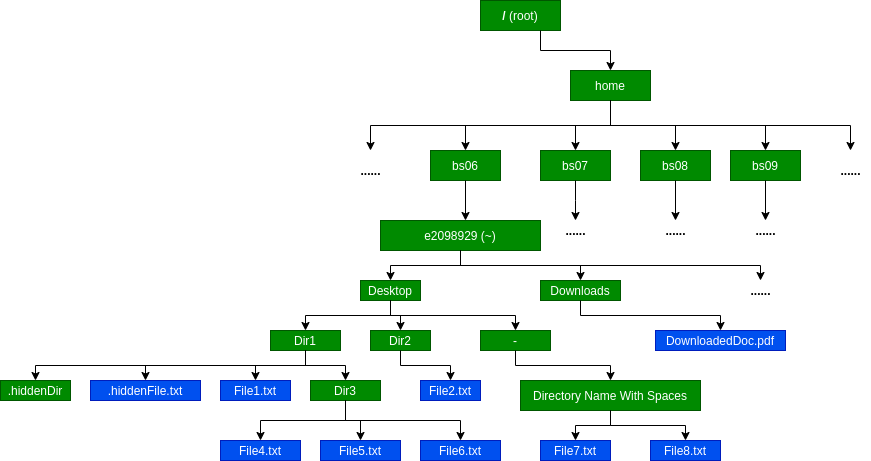

# CENG 111 - LAB1 (FALL 2021)

## Genel Bilgiler

1. Duyurular [ODTUCLASS](https://odtuclass.metu.edu.tr) üzerinden yapılacaktır. Duyuru geldiği zaman, **eXXXXXX@metu.edu.tr** hesabınıza bilgi e-mail'i gönderilecektir. E-mail hesaplarınızı her gün **en az bir defa** kontrol etmelisiniz. Aynı şekilde **eXXXXXXX@ceng.metu.edu.tr** adresinizi de kontrol etmelisiniz.
2. Ceng111 dersinin [web sayfasında](http://ceng.metu.edu.tr/ceng111) ders programı vs. yanında ekstra öğrenim materyalleri de mevcuttur.
3. Görünüşe göre **21 Aralık** dışında her hafta salı lab var(**Section2 için**).
4. Önümüzdeki **3** labda, linux komutlarını öğreneceğiz. **4.** labda ise **LINUX QUIZ** olacak.
5. **LINUX QUIZ**'den sonra, python ile programlamayı öğrenmeye başlayacağız ve her hafta bir önceki hafta öğrendiklerimizle ilgili quiz olacak.
6. Linux komutlarını öğrenirken [Lab Manual](https://user.ceng.metu.edu.tr/~ceng111/lab_manual_2014.pdf)'e göz gezdirerek öğreneceğimiz konular hakkında fikir sahibi olunması yararlı olacaktır.
7. [COW](https://cow.ceng.metu.edu.tr/)' da duyurular yapılmaktadır. Burayı da düzenli bir şekilde kontrol etmek gerekiyor.

## Ubuntu kurulumu hakkında

1. Windowun yanına Ubuntu'yu kurabilirsiniz (dual boot). Computer Club'ın hazırlamış olduğu [Windows'da Ubuntu Yüklü USB Oluşturma](https://www.youtube.com/watch?v=14dUdnKGLlY) ve [Windows'un Yanına Ubuntu Kurulumu (Dual Boot)](https://www.youtube.com/watch?v=6GywlAIJ8F4) vidyolarında kurulumun nasıl yapıldığı anlatılmaktadır.
2. İlk seçenek yerine sanal makine kurarak (**VirtualBox**) hali hazırda kullandığınız işletim sistemi yanına ubuntu kurabilirsiniz. Nasıl yapılacağıyla ilgili şu [tutorial](https://www.youtube.com/watch?v=x5MhydijWmc)'ı inceleyebilirsiniz.

# Linux'a giriş

Lablarımızda bilgisayarlar(inekler) Linux işletim sisteminin Ubuntu dağıtımı kullanılmaktadır. Ilerleyen sınıflarda, bölüm ödevleri ve projelerinde işleri rahat sürdürebilmek için Linux dağıtımlarında komut satırında(terminal) temel işlemleri yapmayı öğrenmek gerekir.


1. **Dosya(File)**: Dosyalar içerisinde bilgi depolayan elemanlardır. İçindeki bilgi birbirinin ardına eklenen **byte**'lardan oluşur.
2. **Klasör(Directory)**: Dosyaları gruplamak için kullanılan elemanlardır. Her **dosya** bir klasör içinde bulunmalıdır. Klasörler, dosyaları gruplandırarak daha kolay bulmamızı sağlar.

## Linux Klasör Yapısı

Linux dağıtımlarında klasörler aşağıdaki ağaç yapısı şeklindedir.


Ağacın en tepesinde özel "**/** " sembolüyle belirtilen root klasörü vardır. **Root**, linux işletim sisteminde bütün dosya ve klasörleri içeren klasördür. Yani klasör ağaç yapısının en tepesinde yer almaktadır.

## Peki ineklerde terminal açınca ya da login olunca hangi klasörde başlıyoruz?

İneklerde ssh ile login olduğumuz zaman veya lablarda terminal açtığımızda ismi kendi kullanıcı adımız (**eXXXXXXX**) olan klasörde başlıyoruz. Bu klasör bizim "**home**" klasörümüzdür. **Home** klasörünü "**~**" sembolüyle gösteririz.

Örneğin labda 11. inek'te login olup terminal açtığımızda;

```bash
eXXXXXXX@inek11:~$
```

gibi bir komut satırını görürüz. Burada;

- **eXXXXXXX**: kullanıcı adı
- **inek11**: host makinanın adı
- **~**: içinde bulunduğumuz klasör

### PATH KAVRAMI

Linux klasör sistemindeki ağaç yapısını düşünecek olursak bu yapıdaki yukarıdan aşağı yönlü çizebileceğimiz yollara **PATH** denir.

Bu durumda **home** klasörümüzün **PATH**'i "**/home/bsXX/eXXXXXXX**" olacaktır.

Bölümümüzde öğrencilerin kendilerine ait **home** klasörleri **bsXX** şeklinde klasörler içinde toplanmıştır. Ve her **bsXX** klasörü içinde **eXXXXXXX** şeklinde öğrenci klasörleri bulunmaktadır.

Örnek olarak **e2098929** kullanıcı adına sahip öğrencinin **home** klasörünün **PATH**'i aşağıda gösterilmiştir.


Klasörlerin **PATH** lerini **3** şekilde ifade edebiliriz.

- Root(" / ") klasöründen itibaren söz konusu klasöre kadar olan **path** şeklinde (**absolute path**)
- İçinde bulunduğumuz klasöre göre (**relative path**)
- Home klasörü ('~') ne göre (**relative path to home**)

Yukarıdaki resme göre şu anda **/home/bs06** klasöründe bulunduğumuzu düşünelim. Bu klasörden **/home/bs06/e2098929** klasörüne giden **path**'i 3 şekilde de yazabiliriz;

- "**/home/bs06/e2098929**" (**absolute path**)
- "**e2098929**" (**relative path**)
- "**~**" (**relative path to home**)

Dosyaların **path**'leri de aynı klasörler gibi yazılır.

## Permissions

Her dosya ve klasörün güvenlik nedeniyle izinleri vardır (**permissions**). Bu izinler kullanıcı tipine göre 3 gruba(**owner**,**group**,**other**) ayrılmıştır ve her gruba özel 3 adet(**read**,**write**,**execute**) izin tipi vardır.

- **owner** -> dosyayı oluşturan kişi
- **group** -> dosyayı oluşturan kişinin bulunduğu grup
- **other** -> herkes

Aynı zamanda **root** kullanıcıları vardır. Bu kullanıcılar sistemde her şeye erişebilirler.

<br/>


yukarıdaki resimde **r**, **w** ve **x** 'lerin değerleri 0 ya da 1 olabilir. Buna göre. 0 ise izin yok, 1 ise izin var demektir;

- **r -> read**: Dosya için izin varsa okunabilir. Klasör için izin varsa içindeki elemanları görüntüleyebiliriz.
- **w -> write**: Dosya için izin varsa dosyayı değiştirebiliriz. Klasör için izin varsa içinde yeni dosyalar/klasörler oluşturup silebiliriz.
- **x -> execute**: Dosya için izin varsa dosyayı çalıştırabiliriz. Klasör için izin varsa o klasörün içine girebiliriz.

Yukarıdaki resimde owner, group ve other için ayrı **r**, **w** ve **x** izinlerinin olduğunu gördük. Bu izinler 0 ya da 1 olabiliyor.

Sadece owner'ın **r**,**w** ve **x** izinlerini düşünecek olursak bu izinleri 2'lik veya 10'luk tabanda bir sayı olarak yazmak mümkün. Örneğin owner için;

- **r**, **w** ve **x** varsa 111 -> 2<sup>2</sup>1 + 2<sup>1</sup>1 + 2<sup>0</sup>1 = 7
- **r** yok, **w** ve **x** varsa 011 -> 2<sup>2</sup>0 + 2<sup>1</sup>1 + 2<sup>0</sup>1 = 3
- **r**, **w** ve **x** yoksa 000 -> 2<sup>2</sup>0 + 2<sup>1</sup>0 + 2<sup>0</sup>0 = 0
- **r** var, **w** yok, **x** varsa 101 -> 2<sup>2</sup>1 + 2<sup>1</sup>0 + 2<sup>0</sup>1 = 5
  
Aynı şeyi **group** ve **other** için de düşünecek olursak dosya ya da klasörün izinlerini 3 tane 10'luk tabanda sayı ile anlatmamız mümkün oluyor. Örnek olarak;

Dosya1 için izinler;

- owner için **r** = 1, **w** = 1, **x** = 0
- group için **r** = 1, **w** = 0, **x** = 0
- other için **r** = 0, **w** = 0, **x** = 0 ise

Dosya1'in izinlerini 640 olarak yazabilirz.


# LAB1 KOMUTLAR


Kullanışlı path'ler;

- ".":  içinde bulunduğumuz klasörün path'i
- "..": içinde bulunduğumuz klasörün üstündeki klasör'ün path'i. Örneğin;
  - /home/bs06/e2098929 klasörü içindeysek ".." ->  /home/bs06 'dır
- "~": home klasörü

Komutları örneklendirmek için bundan sonraki örneklerde aşağıdaki resimde gösterilmiş
klasör yapısında "~" yani home klasöründe başladığımızı varsayalım.

- Yeşiller klasörleri
- Maviler dosyaları göstermektedir



<br/>
<br/>
<br/>

# ECHO

**echo** komutu verdiğimiz argümanı **terminal'e** bastırmaya yarar.

```bash
e2098929@inek15:~$ echo Hello World
Hello World
```
```bash
e2098929@inek15:~$ echo "Hello World"
Hello World
```
# W

**w** komutu bilgisayara sizinle birlikte kimlerin login olduğunu gösterir;

```bash
 21:22:57 up 5 days, 21:55,  2 users,  load average: 0,00, 0,02, 0,00
e2098929@inek15:~$ w
USER     TTY      FROM             LOGIN@   IDLE   JCPU   PCPU WHAT
e2521409 :1       :1               Sal15   ?xdm?   1:44m  0.00s /usr/lib/gdm3/gdm-x-session --run-script env GNOME_SHELL_SESSION_MODE=ubuntu /usr/bin
e2098929    pts/0    111.122.111.57   21:10    1.00s  0.06s  0.00s w

```

# PWD

**pwd** komutu içinde bulunduğumuz klasörün ismini bize verir

```bash
e2098929@inek15:~$ pwd
/home/bs06/e2098929
```
# WHOAMI

Kullanıcının adını döndürür

```bash
e2098929@inek15:~$ whoami
e2098929
```
# HOSTNAME

Bağlı olduğumuz makinenin adını bize verir

```bash
e2098929@inek15:~$ hostname
inek15
```

# CD

İçinde bulunduğumuz klasörü değiştirmemizi sağlar. Örnek olarak "~" yani home klasörü içinde olduğumuzu ve inek15'te login olduğumuzu varsayalım.

<br/>

## Örnek1 - "." Path

```bash
e2098929@inek15:~$ cd .
e2098929@inek15:~$ |
```
mevcut klasör içinde kalır. Çünkü "." içinde bulunduğumuz klasörün **path**'i dir.

<br/>

## Örnek2 - Bir Klasör geriye gitmek


```bash
e2098929@inek15:~$ cd ..
e2098929@inek15:/home/bs06$ |
```

klasör ağaç yapısında bir yukarı klasöre çıkılır. Çünkü ".." içinde bulunduğumuz klasör'ün üstündeki klasör'ün **path**'i dir. 

İçinde bulunduğumuz klasör "**~**"(home) yani "**/home/bs06/e2098929**" ise bir üstündeki klasör de "**/home/bs06**" olacaktır.

<br/>

## Örnek3 - İki Klasör geriye gitmek


```bash
e2098929@inek15:~$ cd ../..
e2098929@inek15:/home$ |
```

Örnek 2 de kullanılan ".." pathi birden çok kullanılabilir. Bu örnekte iki klasör yukarı çıkılmıştır.

<br/>

## Örnek3 - Desktop Klasörüne gitme

Desktop klasörünün içine "~"(Home) içindeyken 4 şekilde ulaşabiliriz

### 1- Bulunduğumuz klasörden itibaren klasör adıyla - (Relative Path)

```bash
e2098929@inek15:~$ cd Desktop
e2098929@inek15:~/Desktop$ |
```

### 2- O anda bulunduğumuz klasör için tanımlanan "." kullanarak - (Relative Path from current directory)

Yukarıdaki örnekten farkı yok.

```bash
e2098929@inek15:~$ cd ./Desktop
e2098929@inek15:~/Desktop$ |
```

### 3- Home klasörü için tanımlanan "~" kullanarak - (Relative Path from home directory)

```bash
e2098929@inek15:~$ cd ~/Desktop
e2098929@inek15:~/Desktop$ |
```

### 4- Root klasöründen ("/") itibaren tüm Path'i yazarak - (Full Path)

```bash
e2098929@inek15:~$ cd /home/bs06/e2098929/Desktop
e2098929@inek15:~/Desktop$ |
```

## Örnek3 - Dir3 klasörüne gitmek

Dir3 klasörünün içine "~"(Home) içindeyken 4 şekilde ulaşılabilir

### 1- Bulunduğumuz klasörden itibaren klasör adıyla - (Relative Path)

```bash
e2098929@inek15:~$ cd Desktop/Dir1/Dir3
e2098929@inek15:~/Desktop/Dir1/Dir3$ |
```

### 2- O anda bulunduğumuz klasör için tanımlanan "." kullanarak - (Relative Path from current directory)

Yukarıdaki örnekten farkı yok.

```bash
e2098929@inek15:~$ cd ./Desktop/Dir1/Dir3
e2098929@inek15:~/Desktop/Dir1/Dir3$ |
```

### 3- Home klasörü için tanımlanan "~" kullanarak - (Relative Path from home directory)

```bash
e2098929@inek15:~$ cd ~/Desktop/Dir1/Dir3
e2098929@inek15:~/Desktop/Dir1/Dir3$ |
```

### 4- Root klasöründen ("/") itibaren tüm Path'i yazarak - (Full Path)

```bash
e2098929@inek15:~$ cd /home/bs06/e2098929/Desktop/Dir1/Dir3
e2098929@inek15:~/Desktop/Dir1/Dir3$ |
```
   
# CD komutunda özel durumlar

Yukarıdaki klasör yapısını anlatan resimde "-" isminde bir klasör var. Desktop klasöründe başladığımızı düşünüp cd ile "-" klasörüne şöyle girmeye çalışalim;

```bash
e2098929@inek15:~/Desktop$ cd -
-bash: cd: OLDPWD not set
```

"-" klasörüne girmek yerine "OLDPWD not set" hatası aldık. Çünkü "cd -" komutunun bir özelliği var.

Eğer daha önce bir klasörün içine cd ile girilmişse, "cd -" bir önce bulunduğumuz klasöre gider. Yukarıdaki örnekte böyle olmadı çünkü Desktop klasöründe başladığımızı kabul ettik. Bu yüzden bir adım öncesi daha tanımlı değil. Bir adım öncesi tanımlı olduğu takdirde "cd -" komutu çalışacaktır.

Örnek olarak;

- "Desktop" klasöründe başlayalım.
-  "Dir3" klasörüne cd ile geçelim. 
-  Sonra "cd -" çalıştıralım.
-  Bir daha "cd -" çalıştıralım.

```bash
e2098929@inek15:~/Desktop$ cd Dir1/Dir3
e2098929@inek15:~/Desktop/Dir1/Dir3$ cd -
e2098929@inek15:~/Desktop$ cd -
e2098929@inek15:~/Desktop/Dir1/Dir3$
```

## Eğer Klasör adı "-" ise

Yukarıdaki klasör yapısını gösteren resimde "-" isminde bir klasör var. Desktop klasöründe başladığımızı düşünelim.

```bash
e2098929@inek15:~/Desktop$ cd -
-bash: cd: OLDPWD not set
```

"-" ismindeki klasöre girebilmek için direk klasörün adını yazamıyoruz. Bunun yerine "." kullanarak ya da root'dan itibaren **full path** vererek girebiliriz.

"**.**" kullanarak

```bash
e2098929@inek15:~/Desktop$ cd ./-
e2098929@inek15:~/Desktop/-$
```

**full path** kullanarak

```bash
e2098929@inek15:~/Desktop$ cd /home/bs06/e2098929/Desktop/-
e2098929@inek15:~/Desktop/-$
```
## Eğer Klasör adında boşluklar varsa

Örnekteki klasör yapısına göre "-" klasörünün içinde "Directory Name With Spaces" isminde bir klasör var. "-" Klasöründe başladığımızı varsayalım. Bu klasöre girerken;

```bash
e2098929@inek15:~/Desktop/-$ cd Directory Name With Spaces
-bash: cd: too many arguments
```
yukarıdaki gibi giremiyoruz. İki şekilde bu sorunu çözebiliriz. Birincisi;

```bash
e2098929@inek15:~/Desktop/-$ cd Directory\ Name\ With\ Spaces
e2098929@inek15:~/Desktop/-/Directory Name With Spaces$
```

yukarıda her boşluktan önce escape karakteri "\\" koyunca boşlukları cd nin okuyabileceği şekilde anlatabiliyoruz. İkinci olarak

```bash
e2098929@inek15:~/Desktop/-$ cd "Directory Name With Spaces"
e2098929@inek15:~/Desktop/-/Directory Name With Spaces$
```

Directory Name With Spaces'in başına ve sonuna '  **"**  ' işareti koyunca cd komutu klasör adını harflerden oluşan bir liste(string) olarak algılıyor. Böylece isminde boşluk bulunan klasörlere bu şekilde girebiliyoruz.

# LS KOMUTU


ls komutu içinde bulunduğumuz dizindeki dosya ve klasörlerin listesini bize verir. Örneğin yukarıdaki klasör yapısını tekrar düşünecek olursak ve Dir1 klasöründe olduğumuzu varsayarsak;

```bash
e2098929@inek15:~/Desktop/Dir1$ ls
Dir3 File1.txt
```
Bu komutla sadece Dir3 klasörü ve File1.txt dosyasını görebildik. Fakat yukarıdaki resme bakacak olursak Dir1 klasörü içinde **.hiddenDir** ve **.hiddenFile.txt** isminde bir klasör ve bir dosya mevcut.

Bu iki dosyayı göremememizin sebebi bu klasör ve dosyanın gizli olmasıdır.

Eğer dosya ya da klasörün isminin ilk karakteri "." ise, sadece ls komutunu yazdığımızda bu elemanları gizli oldukları için göremeyiz.

Gizli dosya ve klasörleri de **ls** komutuyla görebilmek için **ls -a** komutunu kullanmamız gerekir;

```bash
e2098929@inek15:~/Desktop/Dir1$ ls -a
. .. .hiddenDir .hiddenFile.txt Dir3 File1.txt
```
Bu komutla **.hiddenDir** klasörü ve **.hiddenFile.txt** dosyasını görüntüleyebildik. Aynı zamanda bulunduğumuz klasörü belirten **.** klasörü ile bir üst klasörü belirten **..** klasörünü de bu şekilde görüyoruz.

## LS komutuyla dosya izinleri görüntüleme

Permissions kısmında dosya izinlerini görmüştük. **ls** komutuyla dosya ve klasörlerin **permission**'larını da görüntüleyebiliriz. Bunun için **ls -l** komutunu kullanmamız gerekir;

```bash
e2098929@inek15:~/Desktop/Dir1$ ls -l
total 4
drwxr-xr-x e2098929 uucp 4096 Kas 3 16:34 Dir3
-rw-r--r-- e2098929 uucp    0 Kas 3 16:25 File1.txt
```

gelen sonucun ilk satırında listelenen elemanların toplam kullandıkları **physical_block**'ların sayısını verir.
Dir1 klasörü içinde 4 tane eleman var. Alttaki satırlarda;

- İlk sütunda **ilk harf** elemanın türünü belirtir. Geriye kalan harfler **permission**'lardır. Eğer ilk harf:
  - **-** ise file
  - **d** ise directory(folder)
  - **l** ise Soft link
  - **c** ise character-type special file
  - **b** ise Block-type special file
  - **p** ise FIFO file (pipe)
  - **s** ise socket file

<br/>

- **drwxr-xr-x:** bu kısmın en başındaki **d** harfi bu elemanın(Dir3) bir klasör olduğunu söyler. Geri kalan **rwxr-xr-x** ise bu klasörün **permission**'larıdır. Yanı **Dir3** klasörü için;
  - **owner**: **read**, **write** ve **execute** iznine
  - **group**: **read** ve **execute**
  - **other**: **read** ve **execute** iznine sahiptir

<br/>  

- **-rw-r--r--** bu kısmın en başındaki **-** karakteri bu elemanın(File1.txt) bir dosya olduğunu söyler. Geri kalan **rw-r--r--** ise bu dosyanın **permission**'larıdır. Yani **File1.txt** için;
  - **owner**: **read** ve **write**
  - **group**: **read**
  - **other**: **read** iznine sahiptir

<br/>

- **İkinci sütunda** kullanıcı adı yazar
- **Üçüncü sütunda** elemanın boyutu yazar
- **Dört Beş ve Altıncı** sütunlarda oluşturulduğu ya da değiştirildiği zaman yazar
- **Son sütunda** dosya ya da klasörün adı yazar


## LS komutuyla hem izinleri hem de gizli dosya ve klasörleri görüntüleme

Bunun için önceden kullandığımız **-l** ve **-a** parametreleri birleştirilerek **-la** ya da **-al** şeklinde kullanılır. Örneğin **Dir1** için;

```bash
e2098929@inek15:~/Desktop/Dir1$ ls -la
total 16
drwxr-xr-x  4 e2098929 uucp 4096 Kas  3 20:24 .
drwx------ 10 e2098929 uucp 4096 Kas  3 16:26 ..
drwxr-xr-x  3 e2098929 uucp 4096 Kas  3 16:34 Dir3
-rw-r--r--  1 e2098929 uucp    0 Kas  3 16:25 File1.txt
drwxr-xr-x  2 e2098929 uucp 4096 Kas  3 20:23 .hiddenDir
-rw-r--r--  1 e2098929 uucp    0 Kas  3 20:24 .hiddenFile.txt
```

sonucunu alırız. Eğer burada **.** ve **..** klasörlerini görmek istemiyorsak fakat gizli klasör ve dosyaları da görüntelemek istiyorsak **ls -lA** komutunu kullanmamız gerekir.

```bash
e2098929@inek15:~/Desktop/Dir1$ ls -la
total 8
drwxr-xr-x 3 e2098929 uucp 4096 Kas  3 16:34 Dir3
-rw-r--r-- 1 e2098929 uucp    0 Kas  3 16:25 File1.txt
drwxr-xr-x 2 e2098929 uucp 4096 Kas  3 20:23 .hiddenDir
-rw-r--r-- 1 e2098929 uucp    0 Kas  3 20:24 .hiddenFile.txt
```


