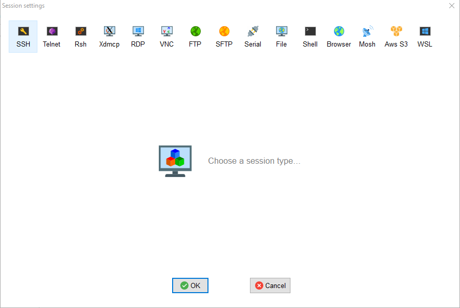
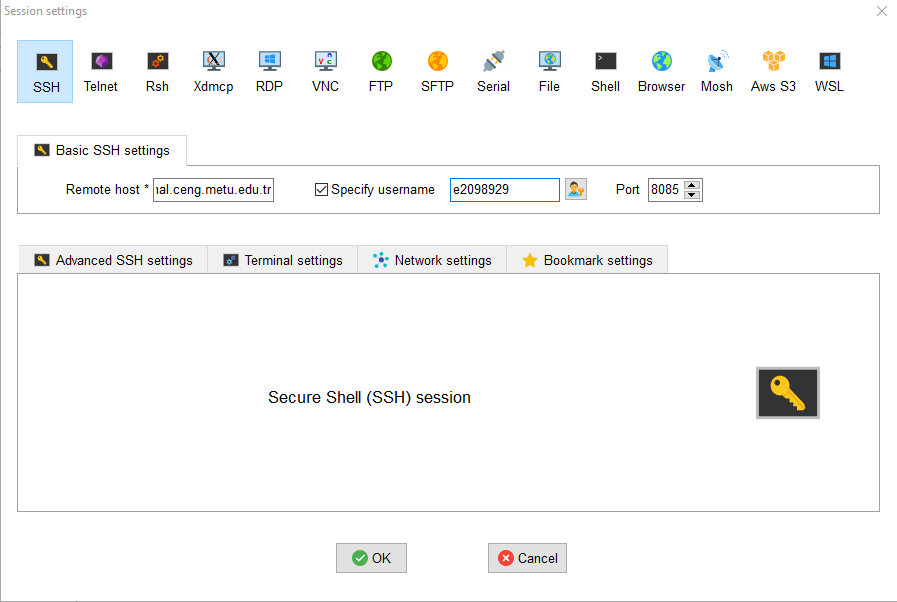
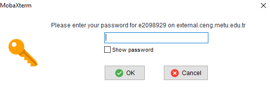
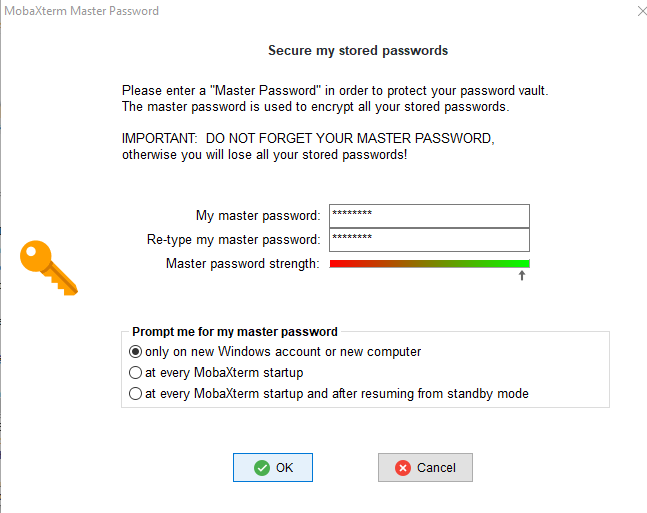
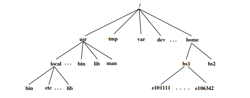
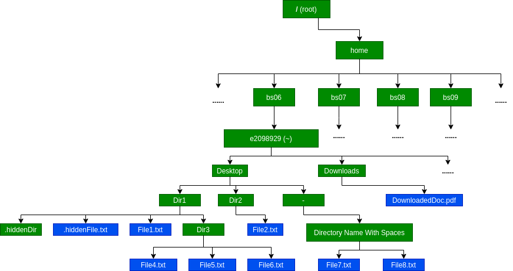

# CENG 111 - LAB1- LAB2 (FALL 2021)

## Genel Bilgiler

1. Duyurular [ODTUCLASS](https://odtuclass.metu.edu.tr) üzerinden yapılacaktır. Duyuru geldiği zaman, **eXXXXXX@metu.edu.tr** hesabınıza bilgi e-mail'i gönderilecektir. E-mail hesaplarınızı her gün **en az bir defa** kontrol etmelisiniz. Aynı şekilde **eXXXXXXX@ceng.metu.edu.tr** adresinizi de kontrol etmelisiniz.
2. Ceng111 dersinin [web sayfasında](http://ceng.metu.edu.tr/ceng111) ders programı vs. yanında ekstra öğrenim materyalleri de mevcuttur.
3. Görünüşe göre **21 Aralık** dışında her hafta salı lab var.
4. Önümüzdeki **3** labda, linux komutlarını öğreneceğiz. **4.** labda ise **LINUX QUIZ** olacak.
5. **LINUX QUIZ**'den sonra, python ile programlamayı öğrenmeye başlayacağız ve her hafta bir önceki hafta öğrendiklerimizle ilgili quiz olacak.
6. Linux komutlarını öğrenirken [Lab Manual](https://user.ceng.metu.edu.tr/~ceng111/lab_manual_2014.pdf)'e göz gezdirerek öğreneceğimiz konular hakkında fikir sahibi olunması yararlı olacaktır.
7. [COW](https://cow.ceng.metu.edu.tr/)' da duyurular yapılmaktadır. Burayı da düzenli bir şekilde kontrol etmek gerekiyor.
8. Linux komutlarının yazılı olduğu [CHEAT SHEET](https://user.ceng.metu.edu.tr/~ceng111/linux_cheat_sheet.pdf)'i ve [Lab Manual](https://user.ceng.metu.edu.tr/~ceng111/lab_manual_2014.pdf)'ı bastırmanız önerilmektedir. Quiz'de bu dokümanlara bakabilirsiniz.

## Ubuntu kurulumu hakkında

1. Windowun yanına Ubuntu'yu kurabilirsiniz (dual boot). Computer Club'ın hazırlamış olduğu [Windows'da Ubuntu Yüklü USB Oluşturma](https://www.youtube.com/watch?v=14dUdnKGLlY) ve [Windows'un Yanına Ubuntu Kurulumu (Dual Boot)](https://www.youtube.com/watch?v=6GywlAIJ8F4) vidyolarında kurulumun nasıl yapıldığı anlatılmaktadır.
2. İlk seçenek yerine sanal makine kurarak (**VirtualBox**) hali hazırda kullandığınız işletim sistemi yanına ubuntu kurabilirsiniz. Nasıl yapılacağıyla ilgili şu [tutorial](https://www.youtube.com/watch?v=x5MhydijWmc)'ı inceleyebilirsiniz.

## Bölüm hesabına windows'tan bağlanma

Bu dokümanda **ssh** komutu linux komutlarının anlatıldığı kısımda anlatılmıştır. Bölümdeki bilgisayarlara ubuntu bilgisayarlarımızda **ssh** komutunu kullanarak bağlanıyoruz. 

Windows'ta bunun için [mobaxterm](https://download.mobatek.net/2142021091974654/MobaXterm_Portable_v21.4.zip)'ü kullanarak rahat bir şekilde bölüm bilgisayarlarına bağlanıp dosya alışverişi yapabilir, terminal komutlarını çalıştırabiliriz.

Yukarıdaki linkten mobaxterm'ün zip dosyasını indirip herhangi bir yere çıkartabilirsiniz. Sonrasında **MobaXterm_Personal_21.4.exe** dosyasını çalıştırın. Karşınıza buna benzer bir ekran gelecek;

Aşağıdaki resimde sol üstteki Session kısmına tıklıyoruz;


SSH kısmını seçiyoruz



Basic SSH settings kısmında;

- Remote host kısmına **external.ceng.metu.edu.tr**
- specify username kısmına tik atıp username'e kendi bölüm kullanıcı adınız
- port kısmına da 8085 giriyoruz



Şifremizi giriyoruz



Kaydetmek istiyorsak onaylıyoruz


Son olarak master şifresi de sorabilir buraya da kafamıza göre şifre girebiliriz



Ve sonunda bölüm bilgisayarında **divan**'a bağlandık. Sol tarafta dosya yapısı da gözüküyor.
Fareyle kendi bilgisayarımızdan kolayca dosya alıp dosya çekebiliriz.


Aynı zamanda açılan terminal'de ssh ile bölüm bilgisayarlarımızdan(inek) herhangi birine örneğin;

- **ssh inek80** diyerek bağlanmak gerekiyor.

Ve böylece windows bilgisayarımızdan da bölüm bilgisayarlarına rahatça bağlanabilir, dosya alışverişi yapıp
terminalde gerekli komutları çalıştırabiliriz.


# Linux'a giriş

Lablarımızda bilgisayarlar(inekler) Linux işletim sisteminin Ubuntu dağıtımı kullanılmaktadır. Ilerleyen sınıflarda, bölüm ödevleri ve projelerinde işleri rahat sürdürebilmek için Linux dağıtımlarında komut satırında(terminal) temel işlemleri yapmayı öğrenmek gerekir.


1. **Dosya(File)**: Dosyalar içerisinde bilgi depolayan elemanlardır. İçindeki bilgi birbirinin ardına eklenen **byte**'lardan oluşur.
2. **Klasör(Directory)**: Dosyaları gruplamak için kullanılan elemanlardır. Her **dosya** bir klasör içinde bulunmalıdır. Klasörler, dosyaları gruplandırarak daha kolay bulmamızı sağlar.

## Linux Klasör Yapısı

Linux dağıtımlarında klasörler aşağıdaki ağaç yapısı şeklindedir.



Ağacın en tepesinde özel "**/** " sembolüyle belirtilen root klasörü vardır. **Root**, linux işletim sisteminde bütün dosya ve klasörleri içeren klasördür. Yani klasör ağaç yapısının en tepesinde yer almaktadır.

## Peki ineklerde terminal açınca ya da login olunca hangi klasörde başlıyoruz?

İneklerde ssh ile login olduğumuz zaman veya lablarda terminal açtığımızda ismi kendi kullanıcı adımız (**eXXXXXXX**) olan klasörde başlıyoruz. Bu klasör bizim "**home**" klasörümüzdür. **Home** klasörünü "**~**" sembolüyle gösteririz.

Örneğin labda 11. inek'te login olup terminal açtığımızda;

```bash
eXXXXXXX@inek11:~$
```

gibi bir komut satırını görürüz. Burada;

- **eXXXXXXX**: kullanıcı adı
- **inek11**: host makinanın adı
- **~**: içinde bulunduğumuz klasör

### PATH KAVRAMI

Linux klasör sistemindeki ağaç yapısını düşünecek olursak bu yapıdaki yukarıdan aşağı yönlü çizebileceğimiz yollara **PATH** denir.

Bu durumda **home** klasörümüzün **PATH**'i "**/home/bsXX/eXXXXXXX**" olacaktır.

Bölümümüzde öğrencilerin kendilerine ait **home** klasörleri **bsXX** şeklinde klasörler içinde toplanmıştır. Ve her **bsXX** klasörü içinde **eXXXXXXX** şeklinde öğrenci klasörleri bulunmaktadır.

Örnek olarak **e2098929** kullanıcı adına sahip öğrencinin **home** klasörünün **PATH**'i aşağıda gösterilmiştir.



Klasörlerin **PATH** lerini **3** şekilde ifade edebiliriz.

- Root(" / ") klasöründen itibaren söz konusu klasöre kadar olan **path** şeklinde (**absolute path**)
- İçinde bulunduğumuz klasöre göre (**relative path**)
- Home klasörü ('~') ne göre (**relative path to home**)

Yukarıdaki resme göre şu anda **/home/bs06** klasöründe bulunduğumuzu düşünelim. Bu klasörden **/home/bs06/e2098929** klasörüne giden **path**'i 3 şekilde de yazabiliriz;

- "**/home/bs06/e2098929**" (**absolute path**)
- "**e2098929**" (**relative path**)
- "**~**" (**relative path to home**)

Dosyaların **path**'leri de aynı klasörler gibi yazılır.

## Permissions

Her dosya ve klasörün güvenlik nedeniyle izinleri vardır (**permissions**). Bu izinler kullanıcı tipine göre 3 gruba(**owner**,**group**,**other**) ayrılmıştır ve her gruba özel 3 adet(**read**,**write**,**execute**) izin tipi vardır.

- **owner** -> dosyayı oluşturan kişi
- **group** -> dosyayı oluşturan kişinin bulunduğu grup
- **other** -> herkes

Aynı zamanda **root** kullanıcıları vardır. Bu kullanıcılar sistemde her şeye erişebilirler.

<br/>


yukarıdaki resimde **r**, **w** ve **x** 'lerin değerleri 0 ya da 1 olabilir. Buna göre. 0 ise izin yok, 1 ise izin var demektir;

- **r -> read**: Dosya için izin varsa okunabilir. Klasör için izin varsa içindeki elemanları görüntüleyebiliriz.
- **w -> write**: Dosya için izin varsa dosyayı değiştirebiliriz. Klasör için izin varsa içinde yeni dosyalar/klasörler oluşturup silebiliriz.
- **x -> execute**: Dosya için izin varsa dosyayı çalıştırabiliriz. Klasör için izin varsa o klasörün içine girebiliriz.

Yukarıdaki resimde owner, group ve other için ayrı **r**, **w** ve **x** izinlerinin olduğunu gördük. Bu izinler 0 ya da 1 olabiliyor.

Sadece owner'ın **r**,**w** ve **x** izinlerini düşünecek olursak bu izinleri 2'lik veya 8'lik tabanda bir sayı olarak yazmak mümkün. Örneğin owner için;

- **r**, **w** ve **x** varsa 111 -> 2<sup>2</sup>1 + 2<sup>1</sup>1 + 2<sup>0</sup>1 = 7
- **r** yok, **w** ve **x** varsa 011 -> 2<sup>2</sup>0 + 2<sup>1</sup>1 + 2<sup>0</sup>1 = 3
- **r**, **w** ve **x** yoksa 000 -> 2<sup>2</sup>0 + 2<sup>1</sup>0 + 2<sup>0</sup>0 = 0
- **r** var, **w** yok, **x** varsa 101 -> 2<sup>2</sup>1 + 2<sup>1</sup>0 + 2<sup>0</sup>1 = 5
  
Aynı şeyi **group** ve **other** için de düşünecek olursak dosya ya da klasörün izinlerini 3 tane 8'lik tabanda sayı ile anlatmamız mümkün oluyor. Örnek olarak;

Dosya1 için izinler;

- owner için **r** = 1, **w** = 1, **x** = 0
- group için **r** = 1, **w** = 0, **x** = 0
- other için **r** = 0, **w** = 0, **x** = 0 ise

Dosya1'in izinlerini 640 olarak yazabilirz.


# LAB1- LAB2 KOMUT VE KAVRAMLAR

Komutları kullanmaya alışmak için [Bandit Oyununun Birkaç Seviyesi](https://overthewire.org/wargames/bandit/) yararlı olabilir. Seviyeler ilerledikçe bu lab'ın gereksinimlerinin çok üstüne çıktığı için sadece merak edenler bakabilir.

Sistem adminliği yapan, Daha çok sistemlerin mimari tarafıyla ilgilenen veya Siber Güvenlikle ilgilenen bilgisayar mühendisleri **linux** komutlarını çok iyi bilir. Bu işlerle çok uğraşmayan bilgisayar mühendisleri temel komutları kendine yetecek kadar bilir.

Kullanışlı path'ler;

- ".":  içinde bulunduğumuz klasörün path'i
- "..": içinde bulunduğumuz klasörün üstündeki klasör'ün path'i. Örneğin;
  - /home/bs06/e2098929 klasörü içindeysek ".." ->  /home/bs06 'dır
- "~": home klasörü

Komutları örneklendirmek için bundan sonraki örneklerde aşağıdaki resimde gösterilmiş
klasör yapısında "~" yani home klasöründe başladığımızı varsayalım.

- Yeşiller klasörleri
- Maviler dosyaları göstermektedir


<br/>
<br/>
<br/>

# ECHO

**echo** komutu verdiğimiz argümanı **terminal'e** bastırmaya yarar.

```bash
e2098929@inek15:~$ echo Hello World
Hello World
```
```bash
e2098929@inek15:~$ echo "Hello World"
Hello World
```
# W

**w** komutu bilgisayara sizinle birlikte kimlerin login olduğunu gösterir;

```bash
 21:22:57 up 5 days, 21:55,  2 users,  load average: 0,00, 0,02, 0,00
e2098929@inek15:~$ w
USER     TTY      FROM             LOGIN@   IDLE   JCPU   PCPU WHAT
e2521409 :1       :1               Sal15   ?xdm?   1:44m  0.00s /usr/lib/gdm3/gdm-x-session --run-script env GNOME_SHELL_SESSION_MODE=ubuntu /usr/bin
e2098929    pts/0    111.122.111.57   21:10    1.00s  0.06s  0.00s w

```

# PWD

**pwd** komutu içinde bulunduğumuz klasörün ismini bize verir

```bash
e2098929@inek15:~$ pwd
/home/bs06/e2098929
```
# WHOAMI

Kullanıcının adını döndürür

```bash
e2098929@inek15:~$ whoami
e2098929
```
# HOSTNAME

Bağlı olduğumuz makinenin adını bize verir

```bash
e2098929@inek15:~$ hostname
inek15
```

# PASSWD

Kullanıcının şifre değiştirmesini sağlar

# CD

İçinde bulunduğumuz klasörü değiştirmemizi sağlar. Örnek olarak "~" yani home klasörü içinde olduğumuzu ve inek15'te login olduğumuzu varsayalım.

<br/>

## Örnek1 - "." Path

```bash
e2098929@inek15:~$ cd .
e2098929@inek15:~$ |
```
mevcut klasör içinde kalır. Çünkü "." içinde bulunduğumuz klasörün **path**'i dir.

<br/>

## Örnek2 - Bir Klasör geriye gitmek


```bash
e2098929@inek15:~$ cd ..
e2098929@inek15:/home/bs06$ |
```

klasör ağaç yapısında bir yukarı klasöre çıkılır. Çünkü ".." içinde bulunduğumuz klasör'ün üstündeki klasör'ün **path**'i dir. 

İçinde bulunduğumuz klasör "**~**"(home) yani "**/home/bs06/e2098929**" ise bir üstündeki klasör de "**/home/bs06**" olacaktır.

<br/>

## Örnek3 - İki Klasör geriye gitmek


```bash
e2098929@inek15:~$ cd ../..
e2098929@inek15:/home$ |
```

Örnek 2 de kullanılan ".." pathi birden çok kullanılabilir. Bu örnekte iki klasör yukarı çıkılmıştır.

<br/>

## Örnek3 - Desktop Klasörüne gitme

Desktop klasörünün içine "~"(Home) içindeyken 4 şekilde ulaşabiliriz

### 1- Bulunduğumuz klasörden itibaren klasör adıyla - (Relative Path)

```bash
e2098929@inek15:~$ cd Desktop
e2098929@inek15:~/Desktop$ |
```

### 2- O anda bulunduğumuz klasör için tanımlanan "." kullanarak - (Relative Path from current directory)

Yukarıdaki örnekten farkı yok.

```bash
e2098929@inek15:~$ cd ./Desktop
e2098929@inek15:~/Desktop$ |
```

### 3- Home klasörü için tanımlanan "~" kullanarak - (Relative Path from home directory)

```bash
e2098929@inek15:~$ cd ~/Desktop
e2098929@inek15:~/Desktop$ |
```

### 4- Root klasöründen ("/") itibaren tüm Path'i yazarak - (Full Path)

```bash
e2098929@inek15:~$ cd /home/bs06/e2098929/Desktop
e2098929@inek15:~/Desktop$ |
```

## Örnek3 - Dir3 klasörüne gitmek

Dir3 klasörünün içine "~"(Home) içindeyken 4 şekilde ulaşılabilir

### 1- Bulunduğumuz klasörden itibaren klasör adıyla - (Relative Path)

```bash
e2098929@inek15:~$ cd Desktop/Dir1/Dir3
e2098929@inek15:~/Desktop/Dir1/Dir3$ |
```

### 2- O anda bulunduğumuz klasör için tanımlanan "." kullanarak - (Relative Path from current directory)

Yukarıdaki örnekten farkı yok.

```bash
e2098929@inek15:~$ cd ./Desktop/Dir1/Dir3
e2098929@inek15:~/Desktop/Dir1/Dir3$ |
```

### 3- Home klasörü için tanımlanan "~" kullanarak - (Relative Path from home directory)

```bash
e2098929@inek15:~$ cd ~/Desktop/Dir1/Dir3
e2098929@inek15:~/Desktop/Dir1/Dir3$ |
```

### 4- Root klasöründen ("/") itibaren tüm Path'i yazarak - (Full Path)

```bash
e2098929@inek15:~$ cd /home/bs06/e2098929/Desktop/Dir1/Dir3
e2098929@inek15:~/Desktop/Dir1/Dir3$ |
```
   
# CD komutunda özel durumlar

Yukarıdaki klasör yapısını anlatan resimde "-" isminde bir klasör var. Desktop klasöründe başladığımızı düşünüp cd ile "-" klasörüne şöyle girmeye çalışalim;

```bash
e2098929@inek15:~/Desktop$ cd -
-bash: cd: OLDPWD not set
```

"-" klasörüne girmek yerine "OLDPWD not set" hatası aldık. Çünkü "cd -" komutunun bir özelliği var.

Eğer daha önce bir klasörün içine cd ile girilmişse, "cd -" bir önce bulunduğumuz klasöre gider. Yukarıdaki örnekte böyle olmadı çünkü Desktop klasöründe başladığımızı kabul ettik. Bu yüzden bir adım öncesi daha tanımlı değil. Bir adım öncesi tanımlı olduğu takdirde "cd -" komutu çalışacaktır.

Örnek olarak;

- "Desktop" klasöründe başlayalım.
-  "Dir3" klasörüne cd ile geçelim. 
-  Sonra "cd -" çalıştıralım.
-  Bir daha "cd -" çalıştıralım.

```bash
e2098929@inek15:~/Desktop$ cd Dir1/Dir3
e2098929@inek15:~/Desktop/Dir1/Dir3$ cd -
e2098929@inek15:~/Desktop$ cd -
e2098929@inek15:~/Desktop/Dir1/Dir3$
```

## Eğer Klasör adı "-" ise

Yukarıdaki klasör yapısını gösteren resimde "-" isminde bir klasör var. Desktop klasöründe başladığımızı düşünelim.

```bash
e2098929@inek15:~/Desktop$ cd -
-bash: cd: OLDPWD not set
```

"-" ismindeki klasöre girebilmek için direk klasörün adını yazamıyoruz. Bunun yerine "." kullanarak ya da root'dan itibaren **full path** vererek girebiliriz.

"**.**" kullanarak

```bash
e2098929@inek15:~/Desktop$ cd ./-
e2098929@inek15:~/Desktop/-$
```

**full path** kullanarak

```bash
e2098929@inek15:~/Desktop$ cd /home/bs06/e2098929/Desktop/-
e2098929@inek15:~/Desktop/-$
```
## Eğer Klasör adında boşluklar varsa

Örnekteki klasör yapısına göre "-" klasörünün içinde "Directory Name With Spaces" isminde bir klasör var. "-" Klasöründe başladığımızı varsayalım. Bu klasöre girerken;

```bash
e2098929@inek15:~/Desktop/-$ cd Directory Name With Spaces
-bash: cd: too many arguments
```
yukarıdaki gibi giremiyoruz. İki şekilde bu sorunu çözebiliriz. Birincisi;

```bash
e2098929@inek15:~/Desktop/-$ cd Directory\ Name\ With\ Spaces
e2098929@inek15:~/Desktop/-/Directory Name With Spaces$
```

yukarıda her boşluktan önce escape karakteri "\\" koyunca boşlukları cd nin okuyabileceği şekilde anlatabiliyoruz. İkinci olarak

```bash
e2098929@inek15:~/Desktop/-$ cd "Directory Name With Spaces"
e2098929@inek15:~/Desktop/-/Directory Name With Spaces$
```

Directory Name With Spaces'in başına ve sonuna '  **"**  ' işareti koyunca cd komutu klasör adını harflerden oluşan bir liste(string) olarak algılıyor. Böylece isminde boşluk bulunan klasörlere bu şekilde girebiliyoruz.

# LS KOMUTU


ls komutu içinde bulunduğumuz dizindeki dosya ve klasörlerin listesini bize verir. Örneğin yukarıdaki klasör yapısını tekrar düşünecek olursak ve Dir1 klasöründe olduğumuzu varsayarsak;

```bash
e2098929@inek15:~/Desktop/Dir1$ ls
Dir3 File1.txt
```
Bu komutla sadece Dir3 klasörü ve File1.txt dosyasını görebildik. Fakat yukarıdaki resme bakacak olursak Dir1 klasörü içinde **.hiddenDir** ve **.hiddenFile.txt** isminde bir klasör ve bir dosya mevcut.

Bu iki dosyayı göremememizin sebebi bu klasör ve dosyanın gizli olmasıdır.

Eğer dosya ya da klasörün isminin ilk karakteri "." ise, sadece ls komutunu yazdığımızda bu elemanları gizli oldukları için göremeyiz.

Gizli dosya ve klasörleri de **ls** komutuyla görebilmek için **ls -a** komutunu kullanmamız gerekir;

```bash
e2098929@inek15:~/Desktop/Dir1$ ls -a
. .. .hiddenDir .hiddenFile.txt Dir3 File1.txt
```
Bu komutla **.hiddenDir** klasörü ve **.hiddenFile.txt** dosyasını görüntüleyebildik. Aynı zamanda bulunduğumuz klasörü belirten **.** klasörü ile bir üst klasörü belirten **..** klasörünü de bu şekilde görüyoruz.

## LS komutuyla dosya izinleri görüntüleme

Permissions kısmında dosya izinlerini görmüştük. **ls** komutuyla dosya ve klasörlerin **permission**'larını da görüntüleyebiliriz. Bunun için **ls -l** komutunu kullanmamız gerekir;

```bash
e2098929@inek15:~/Desktop/Dir1$ ls -l
total 4
drwxr-xr-x e2098929 uucp 4096 Kas 3 16:34 Dir3
-rw-r--r-- e2098929 uucp    0 Kas 3 16:25 File1.txt
```

gelen sonucun ilk satırında listelenen elemanların toplam kullandıkları **physical_block**'ların sayısını verir. Alttaki satırlarda;

- İlk sütunda **ilk harf** elemanın türünü belirtir. Geriye kalan harfler **permission**'lardır. Eğer ilk harf:
  - **-** ise file
  - **d** ise directory(folder)
  - **l** ise Soft link
  - **c** ise character-type special file
  - **b** ise Block-type special file
  - **p** ise FIFO file (pipe)
  - **s** ise socket file

<br/>

- **drwxr-xr-x:** bu kısmın en başındaki **d** harfi bu elemanın(Dir3) bir klasör olduğunu söyler. Geri kalan **rwxr-xr-x** ise bu klasörün **permission**'larıdır. Yanı **Dir3** klasörü için;
  - **owner**: **read**, **write** ve **execute** iznine
  - **group**: **read** ve **execute**
  - **other**: **read** ve **execute** iznine sahiptir

<br/>  

- **-rw-r--r--** bu kısmın en başındaki **-** karakteri bu elemanın(File1.txt) bir dosya olduğunu söyler. Geri kalan **rw-r--r--** ise bu dosyanın **permission**'larıdır. Yani **File1.txt** için;
  - **owner**: **read** ve **write**
  - **group**: **read**
  - **other**: **read** iznine sahiptir

<br/>

- **İkinci sütunda** kullanıcı adı yazar
- **Üçüncü sütunda** elemanın boyutu yazar
- **Dört Beş ve Altıncı** sütunlarda oluşturulduğu ya da değiştirildiği zaman yazar
- **Son sütunda** dosya ya da klasörün adı yazar


## LS komutuyla hem izinleri hem de gizli dosya ve klasörleri görüntüleme

Bunun için önceden kullandığımız **-l** ve **-a** parametreleri birleştirilerek **-la** ya da **-al** şeklinde kullanılır. Örneğin **Dir1** için;

```bash
e2098929@inek15:~/Desktop/Dir1$ ls -la
total 16
drwxr-xr-x  4 e2098929 uucp 4096 Kas  3 20:24 .
drwx------ 10 e2098929 uucp 4096 Kas  3 16:26 ..
drwxr-xr-x  3 e2098929 uucp 4096 Kas  3 16:34 Dir3
-rw-r--r--  1 e2098929 uucp    0 Kas  3 16:25 File1.txt
drwxr-xr-x  2 e2098929 uucp 4096 Kas  3 20:23 .hiddenDir
-rw-r--r--  1 e2098929 uucp    0 Kas  3 20:24 .hiddenFile.txt
```

sonucunu alırız. Eğer burada **.** ve **..** klasörlerini görmek istemiyorsak fakat gizli klasör ve dosyaları da görüntelemek istiyorsak **ls -lA** komutunu kullanmamız gerekir.

```bash
e2098929@inek15:~/Desktop/Dir1$ ls -la
total 8
drwxr-xr-x 3 e2098929 uucp 4096 Kas  3 16:34 Dir3
-rw-r--r-- 1 e2098929 uucp    0 Kas  3 16:25 File1.txt
drwxr-xr-x 2 e2098929 uucp 4096 Kas  3 20:23 .hiddenDir
-rw-r--r-- 1 e2098929 uucp    0 Kas  3 20:24 .hiddenFile.txt
```

# TOUCH

Dosya oluşturmak için **touch** komutu kullanılır. Relative ya da absolute path girip dosyayı eğer **write** permission'ımız varsa istediğimiz yerde oluşturabiliriz

```bash
e2098929@inek15:~/Desktop/Dir1$ ls
Dir3 File1.txt
e2098929@inek15:~/Desktop/Dir1$ touch newFile.txt
e2098929@inek15:~/Desktop/Dir1$ ls
Dir3 File1.txt newFile.txt
```

Başka path'e dosya oluşturma

```bash
e2098929@inek15:~/Desktop/Dir1$ ls
Dir3 File1.txt
e2098929@inek15:~/Desktop/Dir1$ touch newFile.txt
e2098929@inek15:~/Desktop/Dir1$ ls
Dir3 File1.txt newFile.txt
```

```bash
e2098929@inek15:~/Desktop/Dir1$ ls Dir3
-  File4.txt File5.txt File6.txt
e2098929@inek15:~/Desktop/Dir1$ touch Dir3/newFile2.txt
e2098929@inek15:~/Desktop/Dir1$ ls Dir3
-  File4.txt  File5.txt  File6.txt  newFile2.txt
```
Peki varolan bir dosyanın adını girip **touch** kullanırsak ne olur? Dosyanın içindeki bilgiler kaybolmaz, sadece değiştirilme ve dosyaya ulaşım tarihi güncellenir.

**touch** komutu ile aynı anda birden fazla dosya da oluşturabiliriz

```bash
e2098929@inek15:~/Desktop/Dir1$ ls
Dir3  File1.txt  newFile.txt
e2098929@inek15:~/Desktop/Dir1$ touch newFile3.txt newFile4.txt newFile5.txt
e2098929@inek15:~/Desktop/Dir1$ ls
Dir3  File1.txt  newFile.txt  newFile3.txt  newFile4.txt  newFile5.txt
```

# MKDIR

Klasör oluşturmamızı sağlar

```bash
e2098929@inek15:~/Desktop/Dir1$ ls
Dir3 File1.txt  newFile.txt  newFile3.txt  newFile4.txt  newFile5.txt
e2098929@inek15:~/Desktop/Dir1$ mkdir Dir5
e2098929@inek15:~/Desktop/Dir1$ ls
Dir3  Dir5  File1.txt  newFile.txt  newFile3.txt  newFile4.txt  newFile5.txt
```

Aynı isimde başka bir klasör oluşturmaya çalışırsak


```bash
e2098929@inek15:~/Desktop/Dir1$ mkdir Dir5
mkdir: cannot create directory 'Dir5': File exists
```


# MV

Dosyaları belirttiğimiz path'e taşımamızı sağlar.

```bash
e2098929@inek15:~/Desktop/Dir1$ ls
Dir3 File1.txt  newFile.txt  newFile3.txt  newFile4.txt  newFile5.txt
e2098929@inek15:~/Desktop/Dir1$ mv File1.txt Dir3/File1.txt
e2098929@inek15:~/Desktop/Dir1$ ls
Dir3  Dir5  newFile.txt  newFile3.txt  newFile4.txt  newFile5.txt
e2098929@inek15:~/Desktop/Dir1$ cd Dir3
e2098929@inek15:~/Desktop/Dir1/Dir3$ ls
-  File1.txt  File4.txt  File5.txt  File6.txt  newFile2.txt
```

Yukarıdaki mv kullanımında **Dir1** klasörü içindeki **File1.txt** dosyasını **Dir3** klasörünün içine taşıdık.

mv komutunu bir dosyanın adını değiştirmek için de kullabiliriz. Bunun için dosyayı taşıyacağımız yer yine aynı klasörde olmalıdır. Örneğin,

```bash
e2098929@inek15:~/Desktop/Dir1$ ls
Dir3  Dir5  newFile.txt  newFile3.txt  newFile4.txt  newFile5.txt
e2098929@inek15:~/Desktop/Dir1$ mv newFile.txt newFile1000.txt
e2098929@inek15:~/Desktop/Dir1$ ls
Dir3  Dir5  newFile1000.txt  newFile3.txt  newFile4.txt  newFile5.txt
```

# CP

Dosyaları kopyalamamızı sağlar. **mv** komutu gibi önce kopyalamak istediğimiz dosyayı, ondan sonra göndereceğimiz yeri ve ismini seçmemiz gerekir

```bash
e2098929@inek15:~/Desktop/Dir1$ ls
Dir3  Dir5  newFile.txt  newFile3.txt  newFile4.txt  newFile5.txt
e2098929@inek15:~/Desktop/Dir1$ cp newFile3.txt Dir3/newFile500.txt
e2098929@inek15:~/Desktop/Dir1$ ls
Dir3  Dir5  newFile1000.txt  newFile3.txt  newFile4.txt  newFile5.txt
e2098929@inek15:~/Desktop/Dir1$ cd Dir3
e2098929@inek15:~/Desktop/Dir1/Dir3$ ls
-  File1.txt  File4.txt  File5.txt  File6.txt  newFile2.txt  newFile500.txt
```

# RM

Dosyaları silmemizi sağlar

```bash
e2098929@inek15:~/Desktop/Dir1$ ls
Dir100  Dir3  Dir5 newFile.txt newFile1000.txt  newFile3.txt  newFile4.txt  newFile5.txt
e2098929@inek15:~/Desktop/Dir1$ rm -f newFile.txt
e2098929@inek15:~/Desktop/Dir1$ ls
Dir100  Dir3  Dir5  newFile1000.txt  newFile3.txt  newFile4.txt  newFile5.txt
```

Yukarıdaki **rm -f** olmazsa emin olup olmadığımızı soruyor. y(yes) ya da n(no) yazılabilir. 

**ÖNEMLİ** rm -f ile silinen dosyalar geri getirilemez. Fakat grafik arayüz ile silinen dosyalar çöp kutusuna gider. O yüzden rm -f ile dosya silerken çok dikkatli olmak gerekir.

Klasör silmek için de **rm -rf** yazılmalıdır. Buradaki **-r** parametresi **recursive** anlamına gelir. Yani bu klasör ve bunun altındaki her şeyi silmek anlamına gelir. Klasörler **-r** kullanılmadan silinemez.

# RMDIR

Boş olan klasörleri silerken kullanılabilir, bunun için `rm` komutu `-rf` eklenerek de kullanılabilir.

Eğer klasör boş değilse

```bash
e2098929@inek15:~/Desktop/Dir1$ ls
Dir100  Dir3  Dir5 newFile.txt newFile1000.txt  newFile3.txt  newFile4.txt  newFile5.txt RMDIR
e2098929@inek15:~/Desktop/Dir1$ rmdir Dir3
rmdir: failed to remove 'Dir3': Directory not empty
```

Eğer klasör boş ise

```bash
e2098929@inek15:~/Desktop/Dir1$ ls
Dir100  Dir3  Dir5 newFile.txt newFile1000.txt  newFile3.txt  newFile4.txt  newFile5.txt
e2098929@inek15:~/Desktop/Dir1$ rmdir Dir100
e2098929@inek15:~/Desktop/Dir1$ ls
Dir3  Dir5  newFile.txt newFile1000.txt  newFile3.txt  newFile4.txt  newFile5.txt
```


# SSH

Başka bilgisayarlara bağlanmamıza ve o bilgisayarın içinde terminal komutlarını kullanabilmemizi sağlar. Bölüm bilgisayarlarımızın her birinde ssh serverları açıktır. Dışarıdan bağlanırken 8085. portu kullanmak gerekir.

Bölüm bilgisayarlarımıza erişmek için şu komut kullanılır;

```bash
ssh 'kullanıcıAdı'@external.ceng.metu.edu.tr -p 8085
```

Sonrasında bize şifremizi soracak.

Şifreyi de girdikten sonra bizi **divan**'a atacak. **divan**'a girdikten sonra yine benzer şekilde ssh kullanmamız gerek. Örnek olarak inek80'e bağlanalım

```bash
ssh inek80
```
Sonrasında tekrar şifremizi giriyoruz ve böylece bölüm bilgisayarlarımıza bağlanmış oluyoruz.

Bölüm bilgisayarlarının durumunu kontrol etmek [inek status](http://ceng.metu.edu.tr/ineks.html) sayfasını kontrol etmek gerekir.

Dolu bilgisayarlar **full**, boş olanlar **free**, erişilemez olanlar ise **unreachable** olarak sitede yazmaktadır. Bilgiler her 5 dakikada bir güncellenmektedir. Bağlanırken boş olan bilgisayarlara bağlanmayı tercih etmek gerekir.

# SFTP

Başka bilgisayarlara bağlanıp dosya çekmeye veya dosya göndermeye yarar. Bölüm bilgisayarlarına bağlanmak için;

```bash
sftp -P 8085 'kullanıcı adı'@external.ceng.metu.edu.tr
```

şeklinde yazılması lazım. Sonrasında standard linux  `put` ve `get` komutları kullanılarak dosya çekme ve ekleme işlemleri yapılabilir. 

- `put` komutundan sonra local dosyanın pathi ve ardından koymak istediğimiz remote path'i
  
- `get` komutundan sonra remote dosyanın pathi ve ardından koymak istediğimiz local path'i  girmemiz gerekir.
  
- local pathi görmek için `lpwd`, remote path görmek için `pwd` kullanılabilir.

Örneğin evdeki bilgisayardan okul bilgisayarına bağlanmışsak

```bash
sftp> lpwd
Local working directory: /home/yatiyr
sftp> pwd
Remote working directory: /home/bs06/e2098929/Desktop
```
Dosya çekmek için `get` (~/Desktop içinde olduğumuzu düşünelim);

```bash
sftp> ls
-       Dev     Dir1    Dir2    Name    RMDIR   Spaces  With    lab 
sftp> get -r Dir1 /home/yatiyr/Desktop
Fetching /home/bs06/e2098929/Desktop/Dir1/ to /home/yatiyr/Desktop/Dir1
Retrieving /home/bs06/e2098929/Desktop/Dir1
Retrieving /home/bs06/e2098929/Desktop/Dir1/Dir5
Retrieving /home/bs06/e2098929/Desktop/Dir1/Dir3
Retrieving /home/bs06/e2098929/Desktop/Dir1/Dir3/-
Retrieving /home/bs06/e2098929/Desktop/Dir1/.hiddenDir
/home/bs06/e2098929/Desktop/Dir1/newFile1000.txt                                              100%    6     0.2KB/s   00:00
sftp>
```

Yukarıda `get` komutuna `-r` eklememizin sebebi **Dir1**'in klasör olması. Önceki komutlarda uygulanan kurallar geçerlidir.

Ev bilgisayarında **Desktop** içinde olan bir klasörü bölüm hesabına gönderme `put` için;

```bash
sftp> lpwd
Local working directory: /home/yatiyr
sftp> pwd
Remote working directory: /home/bs06/e2098929
sftp> put Desktop/sifre.txt
Uploading Desktop/sifre.txt to /home/bs06/e2098929/sifre.txt
Desktop/sifre.txt                             100%   28     0.4KB/s   00:00 
```

# DU

Dosya ya da klasörlerin diskteki boyutlarını gösterir.

```du``` komutuna ```-s``` eklersek sadece toplam boyutu görürüz. Buna ```-h``` eklersek **human readable** hale getiririz. Örneğin Desktop içinde olup Dir1'e bakalım

```bash
e2098929@inek15:~/Desktop$ du Dir1
4	Dir1/Dir5
4	Dir1/Dir3/-
8	Dir1/Dir3
4	Dir1/.hiddenDir
24	Dir1
e2098929@inek15:~/Desktop$ du -s Dir1
24	Dir1
e2098929@inek15:~/Desktop$ du -sh Dir1
24K	Dir1
```
# CHMOD

Dosyaların izinlerini değiştirmemizi sağlar. [Permissions](#permissions) kısmında belirtilen kurallar çerçevesinde **user**,**group** ve **other** için 8'lik tabanda sayılar yazılır. Örneğin ```chmod 755``` gibi.

Örneğin ```~/Desktop``` içinde ```permission.sh`` diye bir dosyamız olsun;

```bash
e2098929@inek15:~/Desktop$ ls -l permission.txt
---------- 1 e2098929 uucp 0 Kas  8 19:16 permission.txt
```

dosyanın hiçbir izni yok gibi duruyor. Biz bu dosyaya örnek olarak sadece user için **r**,**w** ve **x** izinlerini ```chmod 700``` komutunu yazarak verebiliriz. Fakat bunun başka bir yolu daha var;

```bash
e2098929@inek15:~/Desktop$ ls -l permission.sh
---------- 1 e2098929 uucp 0 Kas  8 19:16 permission.sh,
e2098929@inek15:~/Desktop$ chmod u+rwx permission.sh
e2098929@inek15:~/Desktop$ ls -l permission.sh
-rwx------ 1 e2098929 uucp 27 Kas  8 19:19 permission.sh
```
Yani ```chmod 'permission group(u, g, o)'|'operator(+, -)'|'permission(r,w,x)' ``` kullanarak belli gruplara dosya için izin verip izinlerini geri alabiliriz.

# MAN

Komutların nasıl kullanıldığını gösterir. Kullanıcıların her komutu ezberlemelerinin mümkün olmamasından dolayı ```man``` kullanarak araştırılan komutun hangi argümanları ve parametreleri aldığı görülebilir ve hakkında bilgi edilinebilir.

```bash
e2098929@inek15:~/Desktop$ man ls
```

```man``` komutu girildikten sonra okuma bitince ```q``` tuşuna basarak geri dönülebilir.

# WILDCARDS (KOMUT DEĞİL)

Wildcardlar komut değildir, fakat bazı ifadeleri ayırt etmemizi sağlamaktadır. Bazen dosya sistemimizde çok fazla dosya olabilir ve bizim ihtiyacımız olanlar belki isimleri belli şekilde başlayan,biten vb. şeklinde dosyalardır. Bu durumda **wildcard** kullanabiliriz.

- **?** bir karakter yerine geçer
- **\*** sıfır ya da daha fazla karakter

Örneğin **?_file\*.txt** şeklinde bir ifade girersek;

- Başında herhangi bir harf bulunacak
- **file** kısmından sonra 0 ya da daha fazla karakter gelebilir
- ismin bitiş kısmı **.txt** olmak zorunda

```ls``` , ```rm``` gibi komutlarda dosya isimleri bu şekilde kullanıbilir.

# CAT

Dosyaların içeriğini terminale basar.

```bash
e2098929@inek15:~/Desktop$ cat sifre.txt
sifre=olimp
```

# MORE

Dosya içeriğini bölüm bölüm göstermek için kullanılabilir. ```Enter``` tuşuyla satır satır, ```Space``` tuşuyla sayfa sayfa geçilebilir. ```q``` tuşuyla ise çıkılır

# LESS

```Yukarı``` ve ```Aşağı``` yön tuşlarıyla dosya içeriğini gezebilmemizi sağlar. ```q``` tuşu ile çıkılır

# WGET

Internetten dosya çekebilmemizi sağlar.

Örneğin

```bash
e2098929@inek15:~/Desktop$ wget http://ceng.metu.edu.tr/
```

bölüm sitesinin **.html** dosyası çekilir

# GREP

Dosyaların içinde bulunan kelimeleri aratmak için kullanılır. Önceki komutta ```wget``` ile bölüm sitesinin **.html** dosyasını indirmiştik. Bu dosyada **Department** kelimesini aratırsak

```bash
e2098929@inek15:~/Desktop$ grep Department *.html
index.html:  <title>Department of Computer Engineering</title>
index.html:            <span><a  href="/">Department of Computer Engineering</a></span>
index.html:          <div class="research-body">Multimedia Database Laboratory, established in 2006 at Computer Engineering Department of Middle Eas <a href="/research/multimedia-database-research-lab" class="views-more-link">Learn more</a></div>  </div>
index.html:          <h4 class="list-title"><a href="/departmental-diploma-ceremony">Departmental Diploma Ceremony</a></h4>  </li>
```
# STDIN - STDOUT - STDERR

Bilgisayarımızda çalışan her işlemin 3 tane ana **file descriptor**'u vardır. Bunlar **stdin**, **stdout** ve **stderr**'dir.

- **stdin**: işlemin inputu
- **stdout**: işlemin outputu -> varsayılan olarak terminale basılır
- **stderr**: işlemde oluşan hatalar -> varsayılan olarak terminale basılır

Biz programların **stdin**, **stdout** ve **stderr**'in nerelere yazılacağına kendimiz karar verebiliriz. Bunun için bu kısımları istediğimiz yerlere yönlendirmemiz gerekir.

## STDIN yönlendirme '<'

Örnek olarak ```cat``` komutunun input olarak dosya alması gerekiyor. Bu inputu argüman olarak da yazabiliirz '<' sembolü ile **stdin** i yönlendirerek de yapabiliriz

```bash
e2098929@inek15:~/Desktop$ cat permission.sh
echo "Permission Granted!"
e2098929@inek15:~/Desktop$ cat < permission.sh
echo "Permission Granted!"
```

## STDOUT dosyaya yönlendirme '>'

Komutların sonuçları terminale basılacağına dosyaya kaydedilir.

```bash
e2098929@inek15:~/Desktop$ ls -la > lsOutput.txt
e2098929@inek15:~/Desktop$ cat lsOutput.txt
total 52
drwxr-xr-x  3 e2098929 uucp  4096 Kas  3 16:26 -
drwx------ 11 e2098929 uucp  4096 Kas  8 20:16 .
drwxr-xr-x 23 e2098929 staff 4096 Kas  8 19:19 ..
drwx------  3 e2098929 uucp  4096 Kas  3 00:01 Dev
drwxr-xr-x  5 e2098929 uucp  4096 Kas  8 18:46 Dir1
drwxr-xr-x  2 e2098929 uucp  4096 Kas  3 16:25 Dir2
drwx------  3 e2098929 uucp  4096 Kas  3 00:37 lab
-rw-------  1 e2098929 uucp     0 Kas  8 20:16 lsOutput.txt
```

## STDERR dosyaya yönlendirme '2>'

Komutlardan elde edilen hatalar kaydedilir

```bash
e2098929@inek15:~/Desktop$ ls -la  asdasdasdasdas.txt 2> lsOutput.txt
e2098929@inek15:~/Desktop$ cat lsOutput.txt
ls: cannot access 'asda.txt': No such file or directory
```

**STDOUT** ve **STDERR** dosya yönlendirmesinde sadece bir '>' kullanılırsa dosya içinde önceden yazılmış tüm bilgiler silinir. Fakat biz dosyada daha önce var olan bilgilerin altına yazdırmak istiyorsak **stdout** için '>>', **stderr** için '2>>' kullanmamız gerekir.

# PIPE

Birden fazla programın inputları ile outputlarını birbirine bağlamamızı sağlar.